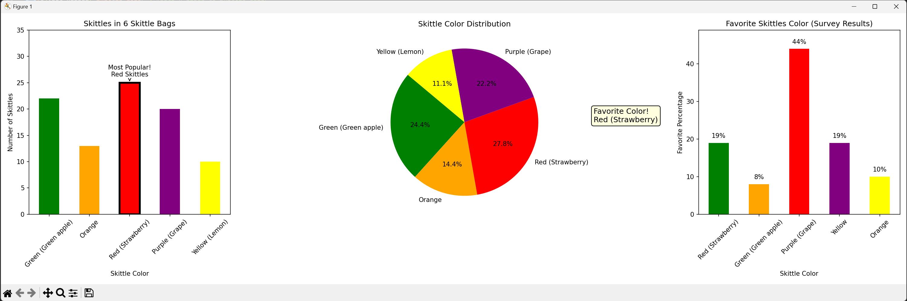
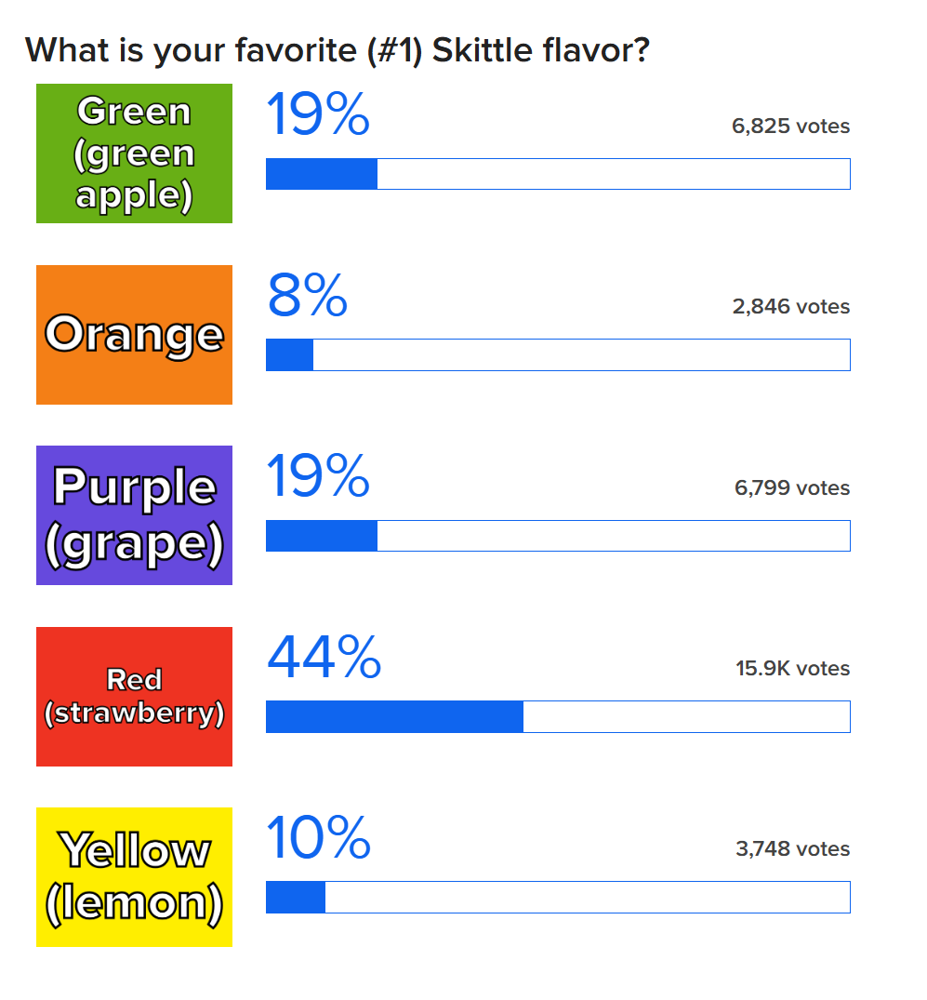

# Skittle Graphs Plotting

In this assianment, we coded a script that takes values about skittles and plots them into three different graphs. 2 Bar charts and a Pie chart.

## First Bar Chart
In this first chart, we are displying a bar chart that displays the 5 classic Skittle colors/flavors as well as how many of each color were found in 6 small Skittle's bags. The information shows that from 6 Skittle bags, we got 25 red Skittles, 22 green Skittles, 19 purple Skittles, 13 orange Skittles and 10 yellow Skittles.
## Pie Chart
In this second chart, we display a pie chart that shows the same data from the first graph, but instead the information is presented in a pie chart.
## Second Bar Chart
In this third chart, we show the values of peoples favorite Skittle colors. We see 44% favor red, 19 favor green, 19% favor purple, 10% favor orange, and 8% favor yellow.

**We found the percentages of favorite skittles from this poll...**

### Running the code.
To run the code, one would go to terminal and type...
```
python3 .\skittles.py
```
This assignment taught us important features of both **import pandas** and **import matplotlib.**
Here are some important lines...
```
df = pd.DataFrame(skittle_data)
```
This line sets up the data from from our skittle data array. Basically setting up a table with all the information to then be put in the charts.
```
axs[0].set_xlabel("Skittle Color")
axs[0].set_ylabel("Number of Skittles")
axs[0].set_title("Skittles in 6 Skittle Bags")
```
These lines take our chart and add labels for all the information on the x and y axis, as well as the title for the chart.
```
for i, v in enumerate(favorite_df['Favorite Percentage']):
    axs[2].text(i, v + 1, f'{v}%', ha='center', va='bottom', fontsize=10)
```
This line is responsible for annotating the value on the graph and it also prints the percentage.
```
"Skittle Color": ["Green (Green apple)", "Orange", "Red (Strawberry)", "Purple (Grape)", "Yellow (Lemon)"],
"Number of Skittles": [22, 13, 25, 20, 10],
"Favorite Percentage": [19, 8, 44, 19, 10],
```
These lines are our flavors as well as the collected data for our graphs to be made.